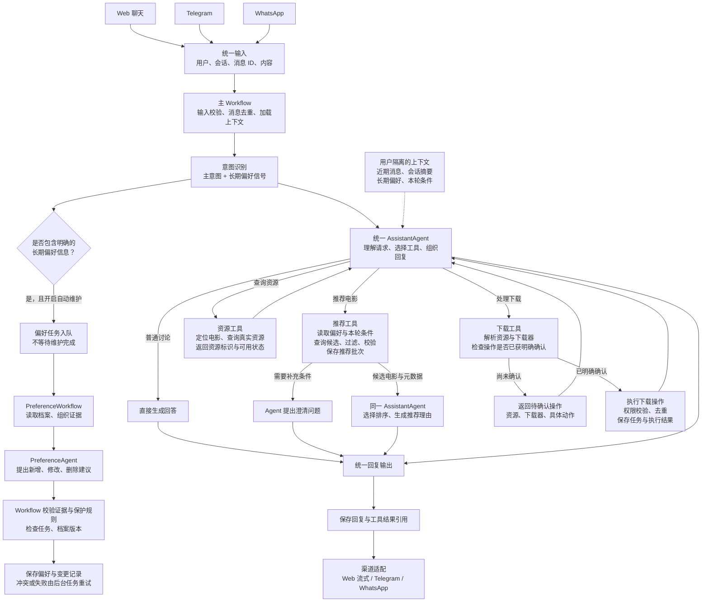

# Message Chain

```mermaid
flowchart TD
    WEB["Web 聊天"] --> INPUT["统一输入<br/>用户、会话、消息 ID、内容"]
    TG["Telegram"] --> INPUT
    WA["WhatsApp"] --> INPUT

    INPUT --> MAIN["主 Workflow<br/>输入校验、消息去重、加载上下文"]
    MAIN --> DETECT["意图识别<br/>主意图 + 长期偏好信号"]

    DETECT --> SIGNAL{"是否包含明确的<br/>长期偏好信息？"}
    SIGNAL -->|"是，且开启自动维护"| QUEUE["偏好任务入队<br/>不等待维护完成"]
    QUEUE --> PW["PreferenceWorkflow<br/>读取档案、组织证据"]
    PW --> PA["PreferenceAgent<br/>提出新增、修改、删除建议"]
    PA --> VALIDATE["Workflow 校验证据与保护规则<br/>检查任务、档案版本"]
    VALIDATE --> SAVE["保存偏好与变更记录<br/>冲突或失败由后台任务重试"]

    DETECT --> AGENT["统一 AssistantAgent<br/>理解请求、选择工具、组织回复"]

    CONTEXT["用户隔离的上下文<br/>近期消息、会话摘要<br/>长期偏好、本轮条件"] -.-> AGENT

    AGENT -->|"普通讨论"| DISCUSS["直接生成回答"]
    AGENT -->|"推荐电影"| REC["推荐工具<br/>读取偏好与本轮条件<br/>查询候选、过滤、校验<br/>保存推荐批次"]
    REC -->|"需要补充条件"| CLARIFY["Agent 提出澄清问题"]
    REC -->|"候选电影与元数据"| RANK["同一 AssistantAgent<br/>选择排序、生成推荐理由"]

    AGENT -->|"查询资源"| RESOURCE["资源工具<br/>定位电影、查询真实资源<br/>返回资源标识与可用状态"]

    AGENT -->|"处理下载"| DOWNLOAD["下载工具<br/>解析资源与下载器<br/>检查操作是否已获明确确认"]
    DOWNLOAD -->|"尚未确认"| CONFIRM["返回待确认操作<br/>资源、下载器、具体动作"]
    DOWNLOAD -->|"已明确确认"| EXECUTE["执行下载操作<br/>权限校验、去重<br/>保存任务与执行结果"]

    DISCUSS --> OUTPUT["统一回复输出"]
    CLARIFY --> OUTPUT
    RANK --> OUTPUT
    RESOURCE --> AGENT
    CONFIRM --> AGENT
    EXECUTE --> AGENT
    AGENT --> OUTPUT

    OUTPUT --> STORE["保存回复与工具结果引用"]
    STORE --> DELIVERY["渠道适配<br/>Web 流式 / Telegram / WhatsApp"]
```