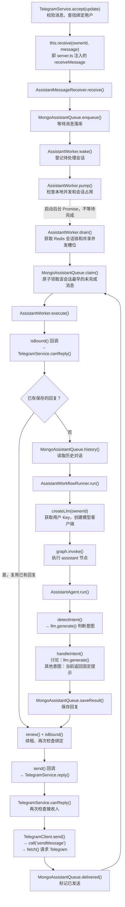

# Message Chain

```mermaid
flowchart TD
    A["TelegramService.accept(update)<br/>校验消息、查找绑定用户"]
    B["this.receive(ownerId, message)<br/>即 server.ts 注入的 receiveMessage"]
    C["AssistantMessageReceiver.receive()"]
    D["MongoAssistantQueue.enqueue()<br/>等待消息落库"]
    E["AssistantWorker.wake()<br/>登记待处理会话"]
    F["AssistantWorker.pump()<br/>检查本地并发和会话占用"]
    G["AssistantWorker.drain()<br/>获取 Redis 会话锁和共享并发槽位"]
    H["MongoAssistantQueue.claim()<br/>原子领取该会话最早的未完成消息"]
    I["AssistantWorker.execute()"]
    J["isBound() 回调<br/>→ TelegramService.canReply()"]
    K{"已有保存的回复？"}
    L["MongoAssistantQueue.history()<br/>读取历史对话"]
    M["AssistantWorkflowRunner.run()"]
    N["createLlm(ownerId)<br/>获取用户 Key，创建模型客户端"]
    O["graph.invoke()<br/>执行 assistant 节点"]
    P["AssistantAgent.run()"]
    Q["detectIntent()<br/>→ llm.generate() 判断意图"]
    R["handleIntent()<br/>讨论：llm.generate()<br/>其他意图：当前返回固定提示"]
    S["MongoAssistantQueue.saveResult()<br/>保存回复"]
    T["renew() + isBound()<br/>续租、再次检查绑定"]
    U["send() 回调<br/>→ TelegramService.reply()"]
    V["TelegramService.canReply()<br/>再次检查接收人"]
    W["TelegramClient.send()<br/>→ call('sendMessage')<br/>→ fetch() 请求 Telegram"]
    X["MongoAssistantQueue.delivered()<br/>标记已发送"]

    A --> B --> C --> D --> E
    E --> F
    F -. "启动后台 Promise，不等待完成" .-> G
    G --> H --> I --> J --> K
    K -- 否 --> L --> M --> N --> O --> P --> Q --> R --> S
    K -- 是，复用已有回复 --> T
    S --> T --> U --> V --> W --> X
    X --> H
```